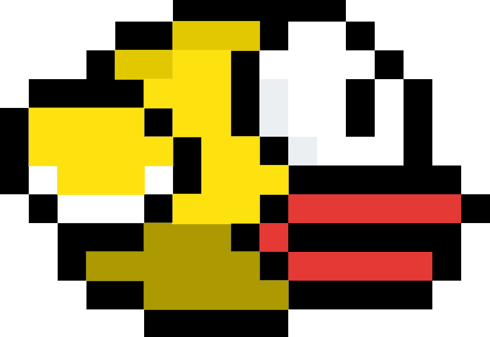

## Sobre projeto

Esse projeto foi criado com o intuito de aplicar meus conhecimentos adquiridos no cursos de laravel, em um projeto desafiador e divertido no qual eu utilizo algumas das linguagens mais conhecidas do mercado, com o intuito de representar um flappybird.

## Recursos utilizados

- PHP
- JS
- Laravel
- Vue
- Bootstrap
- MySql

## Hospedagem

- **[Heroku](https://id.heroku.com)**

## Agradecimentos

Primeiramente, agradeço a **Mayk**, um amigo de longa data, no qual criou o background da nuvens para que eu podesse utilizar no projeto.

## Atualizações

- Bird point
- Update homePage
- Update icon
- Update loginController
- Update Logincontroller
- Update function Login
- Update
- Update:funciont login
- Update:project
- Update LoginController.php
- Update session.php
- Update session.php
- Update LoginController.php
- Update LoginController.php
- Update LoginController.php
- Update LoginComponent.vue
- Update LoginComponent.vue
- Update RouteServiceProvider.php
- FEAT:Update LoginComponent.vue
- FEAT:Update EndGameModalComponent.vue
- FEAT:Update HomeGameComponent.vue
- FEAT: Update AppServiceProvider.php
- FEAT: Update composer.json
- FEAT: Update package.json
- FEAT:New Arquive
- FIX: outPut
- FIX: outDir public
- FIX:OutDir: dist
- FEAT:Sound and background
- FEAT:Create register validator
- FEAT:Create rankPage
- FEAT:Create modal start and end
- FEAT:Create Modal
- FEAT:Create backend score
- FEAT: Crete pagegame

## Informações adicionais

Euzebio Batista [@Linkedin](https://www.linkedin.com/in/euzebio-batista) - euzebio.batista2@gmail.com

Criado por **Euzebio Batista**.
**Todos os direitos reservados.**
